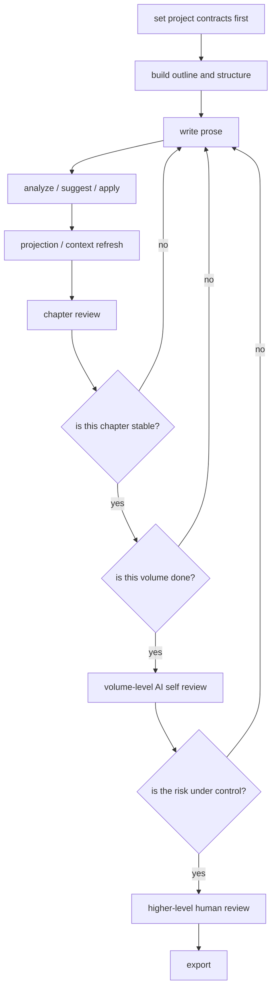

# Story Canvas

[English](./README.en.md) | [简体中文](./README.md)

Story Canvas is a story workspace for agents and authors.

It is no longer just an early command-only prototype. The main loop is already in place: project contracts, outlines, prose, review, projection, context refresh, volume-level self review, and export all connect together. The UI is still early, and the CLI is mostly there for agents and automation. Human-side workflows will move more into the GUI later, but that is not the focus right now.

## What It Is

- A file-protocol-driven story engineering workspace
- A tool that turns writing, review, revision, and rewriting into a closed loop
- A base that also covers long-form serial work, regression samples, and illustration assets

## Current Progress

- Project contracts already live in `project.yaml`, including positioning, story contract, emotional contract, and commercial positioning
- Outline direction, beats, scene plans, and prose already work together
- `chapter analyze`, `chapter suggest`, `review apply`, `projection apply`, `context refresh`, and `review chapter/scene` already form a usable loop
- Volume-level AI self review is already part of the workflow, not just a single-chapter add-on
- Illustration generation and the early UI are still moving in parallel
- The main flow is command-driven today, but this README is no longer trying to serve humans with a full CLI reference

## How It Works



The point of the diagram is simple: you do not just draft and ship. You set the structure first, then move through writing, analysis, review, revision, and only export once the loop has settled.

- The front half is the chapter loop, where gating, drafting, review, and rewrites stay connected
- The back half is the volume loop, where "one chapter passed" does not get mistaken for "the whole thing is ready"
- If the volume risk is still open, the workflow goes back to prose, structure, or scene boundaries

## Why It Helps Writing

- Proposals stay separate from canon, so the project does not blur together
- Chapter analysis is explicit, not a guess
- Machine-readable state only changes after a clear decision
- Local context is refreshed for the next round instead of stuffing the whole project back in every time
- Chapter-level and scene-level quality get checked before stopping
- Fiction work becomes an iterative process instead of a one-shot draft

## Current Boundaries

- `v1.0.x` is still anchored on stable story protocol, workflow closure, and sample-backed regression
- Illustration generation and early UI work are no longer fully postponed to `v1.1`; they move in parallel now
- `story-canvas` is the current main entrypoint, but this README is not meant to be a CLI reference for humans
- Human-facing workflows will move more into the GUI later, but that is still in the setup phase

## How the Workspace Is Split Up

The writing flow is organized into these layers:

1. `chapters/*.md` for prose
2. `proposals/draft-proposals.yaml` for pre-canon proposals
3. `reviews/change-requests.yaml` for post-analysis edits
4. `projections/projection.yaml` for the current machine-facing truth
5. `projections/context-lens.yaml` for local chapter context

## What People Should Read First

If you want to understand the flow first, start here:

- [Workflow guide](./docs/guides/creative-workflow.md)
- [Sample matrix](./docs/guides/sample-matrix.md)
- [Quickstart](./docs/guides/quickstart.md)
- [Roadmap](./docs/roadmap.md)

If you want the full process detail, `creative-workflow.md` has a longer Mermaid diagram and the stop conditions. This README keeps only the part that helps people understand the project at a glance.

## What Is Already in Place

- A file-based story protocol
- An agent-facing state-transition entrypoint
- Sample projects under `projects/`
- Smoke tests and regression baselines
- An optional provider layer for external SDK / API integrations
- Provider-backed illustration generation
- A commercial long-form sample with project-level positioning and a serial blueprint

## What Still Needs Work

- A more useful human review surface
- A fuller GUI workspace
- More genre and workflow template packs
- More stable provider integrations
- A richer sample matrix

## Development

Sync the environment:

```powershell
uv sync
```

Run smoke tests:

```powershell
uv run python -m unittest discover -s tests
```

Run a structural check on a story project:

```powershell
uv run story-canvas doctor --root .\projects\demo-short-story
```

Install a host adapter:

```powershell
uv run python scripts/install_adapter.py --host codex --force
uv run python scripts/install_adapter.py --host claude --workspace <workspace-root> --force
```

Install multiple adapters at once:

```powershell
uv run python scripts/install_adapters.py --workspace <workspace-root> --force
```

## Further Reading

- `CONTRIBUTING.md`
- [docs/guides/creative-workflow.md](./docs/guides/creative-workflow.md)
- [docs/guides/quickstart.md](./docs/guides/quickstart.md)
- [docs/guides/sample-matrix.md](./docs/guides/sample-matrix.md)
- [docs/guides/releasing.md](./docs/guides/releasing.md)

## Roadmap

- Stabilize provider-backed extension points and optional dependency boundaries
- Expand `projects/` coverage and keep it aligned with smoke coverage
- Add deeper schema checks, especially for graph, thread, structure, and commercial workflow semantics
- Keep validating more complex production flows against real long-form projects
- Revisit the release strategy only after the Python CLI contract has settled
