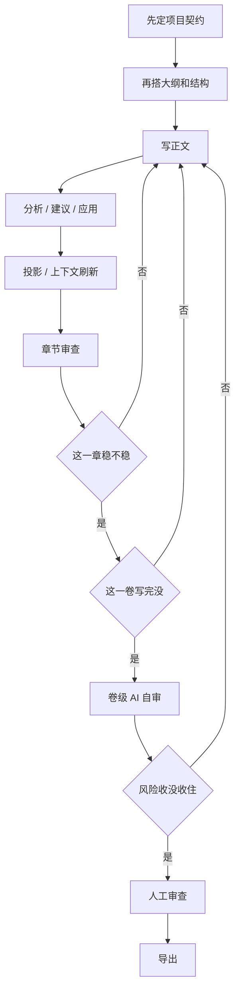

# Story Canvas

[English](./README.en.md) | [简体中文](./README.md)

Story Canvas 是一个给 Agent 和作者一起用的故事工作台。

现在它已经不是“只会吐命令”的早期原型了，主链路基本能跑通：项目契约、大纲、正文、审查、投影、上下文刷新、卷级自审和导出都已经串起来。UI 还在早期，CLI 主要还是给 agent 和自动化流程用的；人类这边后面会慢慢更多地通过 GUI 来处理，但现在还不是重点。

## 这是什么

- 一个文件协议驱动的故事工程
- 一个把“写作、审查、修正、再写作”串成闭环的工具
- 一个同时照顾长篇连载、样例回归和插画资产流的工作台骨架

## 现在做到哪

- 项目契约已经落盘，`project.yaml` 里能放定位、故事契约、情绪契约和商业定位
- 大纲、章节方向、beats、scenePlans 已经能和正文一起跑
- `chapter analyze`、`chapter suggest`、`review apply`、`projection apply`、`context refresh`、`review chapter/scene` 这条链路已经能形成闭环
- 卷级 AI 自审已经进入工作流，不再只是停在单章评审
- 插画生成链路和早期 UI 还在并行推进
- 目前主流程还是命令行驱动，但 README 里不再把 CLI 当成给人类读的主内容

## 工作原理



这张图想表达的就是一件事: 不是写完就交，而是先把结构立住，再进入正文，再经历分析、审查、修正，最后才导出。

- 前半段是章节闭环，重点是把门禁、正文、审查和回写串起来
- 后半段是卷级闭环，重点是别把“单章能过”误判成“整卷能交”
- 只要卷级风险还没收住，就继续回到正文、结构或场景边界去改

## 它为什么能帮写作

- 把“提案”和“正史”分开，避免写着写着混掉
- 章节分析不靠猜，先审再动手
- 只有做了明确决策，才更新机器可读状态
- 写下一轮前先刷新本地上下文，别每次都把整个项目重新塞回去
- 停之前顺手看一眼章节级和场景级质量，省得漏掉问题
- 把小说写作收成一个能反复迭代、还能回头查的流程

## 现在的边界

- `v1.0.x` 仍以稳定故事协议、workflow 闭环和样例回归为锚点
- 插画生成和早期 UI 不再完全后置到 `v1.1`，而是提前并行推进
- `story-canvas` 是当前主入口，但这份 README 不是给人背 CLI 命令的地方
- 人类操作体验后面会更多落到 GUI，但现在还在铺路阶段

## 这套东西怎么分层

现在写作流程大概分成这几层：

1. `chapters/*.md`：正文
2. `proposals/draft-proposals.yaml`：进入正史前的提案
3. `reviews/change-requests.yaml`：分析之后生成的修改建议
4. `projections/projection.yaml`：当前机器可读真相层
5. `projections/context-lens.yaml`：当前章节的局部写作上下文

## 人类先看什么

如果你想先理解它怎么跑，建议直接看这些：

- [工作流说明](./docs/guides/creative-workflow.md)
- [样例工程矩阵](./docs/guides/sample-matrix.md)
- [快速上手](./docs/guides/quickstart.md)
- [路线图](./docs/roadmap.md)

如果你想看更完整的流程细节，`creative-workflow.md` 里有更长的 Mermaid 图和停止条件说明。README 这里只保留让人一眼看懂的主线。

## 现在已经有的能力

- 基于文件协议的故事工程状态层
- 面向 agent 的状态推进入口
- 存放在 `projects/` 下的样例工程
- smoke tests 与可回归的故事基线
- 面向外部 API / SDK 的可选 provider 基础层
- 面向插画生成的 provider-backed 图片能力
- 带有商业化定位与连载蓝图的长篇样例

## 还差什么

- 更顺手的人类审查界面
- 更完整的 GUI 工作台
- 更多题材模板和工作流模板
- 更稳定的 provider 集成
- 更丰富的样例矩阵

## 开发

同步环境:

```powershell
uv sync
```

跑 smoke tests:

```powershell
uv run python -m unittest discover -s tests
```

对一个故事项目做结构校验:

```powershell
uv run story-canvas doctor --root .\projects\demo-short-story
```

安装宿主 adapter:

```powershell
uv run python scripts/install_adapter.py --host codex --force
uv run python scripts/install_adapter.py --host claude --workspace <workspace-root> --force
```

一次装多个 adapter:

```powershell
uv run python scripts/install_adapters.py --workspace <workspace-root> --force
```

## 进一步阅读

- `CONTRIBUTING.md`
- [docs/guides/creative-workflow.md](./docs/guides/creative-workflow.md)
- [docs/guides/quickstart.md](./docs/guides/quickstart.md)
- [docs/guides/sample-matrix.md](./docs/guides/sample-matrix.md)
- [docs/guides/releasing.md](./docs/guides/releasing.md)

## 路线图

- 稳定 provider-backed 扩展点和 optional dependency 边界
- 扩大 `projects/` 样例覆盖并和 smoke coverage 对齐
- 补更深的 schema 校验，尤其是 graph、thread、structure 和商业 workflow 语义
- 用真实长篇项目继续验证更复杂的生产流程
- 在 Python CLI 契约稳定后，再回头看发行策略
