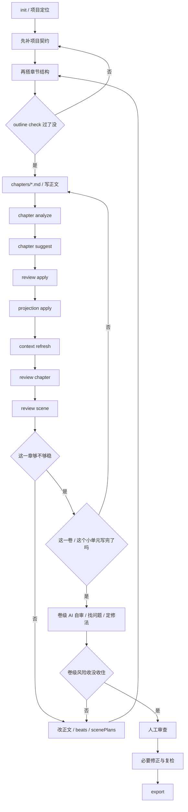

# 创作流程指南

> 最后更新: 2026-04-23
> 适用对象: 作者 / 外部 AI / 代理式写作者

## 1. 目标

把小说当作一个可回归、可评审、可迭代的工程项目。

## 2. 一句话流程

先定项目契约，再拆章节结构，再写正文；先完成单章闭环，再完成整卷自审闭环；人工审查默认发生在卷级 AI 自审之后，最后再导出。

在进入正文前，先读：

- [写作规则包](./writing-rules.md)
- [卷级 AI 自审模板](./volume-self-review.md)

## 3. 完整闭环



这张图看的是主线，不是把所有命令都塞进去：

- 前半段是章节闭环，重点是先把门禁过掉，再写，再审，再回写
- 后半段是卷级闭环，重点是别把“单章能过”误判成“整卷能交”
- 只要卷级风险还没收住，就继续回到正文、结构或场景边界去改

### 3.1 章节闭环

章节闭环主要是在卡这几件事：

- 这一章先过最小前置门禁
- 这一章完整跑过 analyze / suggest / apply / projection / context / review
- 这一章至少经历过一轮修正和复检

章节闭环跑完以后，默认还是接着往下写，不会立刻跳去人工终审。

### 3.2 卷级闭环

卷级闭环主要是在确认这些事：

- 一个完整卷，或者一个明确的小故事单元，已经写完了
- AI 要先站在整卷视角看承接、逻辑、人物、冲突、高潮和 AI 味
- 先把缺陷归因和修正动作列出来
- 再把收敛过的版本交给人工审查

当前还在实验阶段，所以卷级 AI 自审至少要把这些问题说清楚：

1. 章与章之间是否自然承接
2. 是否只是把细纲事项平铺成正文
3. 角色是否仍像同一个人，而不是被剧情硬推着走
4. 冲突与悬念是否逐步升级，而不是原地重复
5. 哪些问题属于 `generation_miss`、`self_review_miss`、`tooling_miss`

## 4. 作者清单

1. 先写 `project.yaml` 里的 `positioning.primaryGenre`、`positioning.targetAudience`、`storyContract.corePromises`、`storyContract.paceContract`
2. 如果是商业连载，再补 `commercialPositioning.premise`、`hookLine`、`targetPlatform`、`serializationModel`、`releaseCadence` 和章节字数目标
3. 如需先定大结构，可先用 `structure list/apply/show/check` 选择三幕、五幕、英雄之旅或 Save the Cat 模板
4. 选定模板后，运行 `structure scaffold` 把结构模板直接落到具体章节方向和 `beats`；如有明确分配，再补 `structure map`
5. 再细化 `outline.yaml`，补章节级 `scenePlans` 与手工方向
6. 若进入下一章，优先用 `chapter create` 原子化创建章节文件、章节骨架并推进 `activeChapterId`
7. `init` 后先跑 `status --chapter-id <id>`，读取 `startGuide` 给出的下一步命令；默认第一章是空白 stub，不再把说明文案塞进正文
8. 在开始正文或让 AI 继续细化前，先跑 `outline check`，确认章节已具备“项目契约 + direction + beats + scenePlans”
9. 如果当前章还没有正文段落，先在 `chapters/<chapter-id>.md` 里按计划场景写 1 段骨架，再运行 `outline scene-detect` 生成首版 `scenePlans`
10. 写 `chapters/*.md` 时保留清晰的实体标记
11. 每写完一章先跑 `chapter analyze`
12. 再跑 `chapter suggest`、`review apply`、`projection apply`
13. 用 `context refresh` 生成下一轮上下文
14. 用 `review chapter` 和 `review scene` 评审质量；商业连载项目要同时看 `contractAlignment`、`commercialAlignment` 和 `weightedScores.profile.targetPlatform`
15. 用 `stats` 或 `doctor` 检查章节是否达到项目定义的字数区间；商业连载项目会优先读取 `commercialPositioning.chapterWordFloor/Target`
16. 分数低、结构偏移或字数不足就改正文、结构映射或场景边界，再复评
17. 如果当前卷已完成，先做一轮卷级 AI 自审，再进入人工审查
18. 人工审查后按需修正并复检
19. 最后 `export`

## 5. 外部 AI 清单

1. 先读 `project.yaml`
2. 再读 `outline.yaml`
3. 如果项目启用了结构模板，先看 `structures.yaml` 和章节 `beats` / `direction`
4. 如果要推进下一章，优先用 `chapter create`，不要直接改 `project.yaml` / `outline.yaml`
5. 先跑 `status --chapter-id <id>`，优先消费 `startGuide`；如果当前章还是空白 stub，先补结构和场景骨架，不要直接评审空稿
6. 跑 `outline check`，确认目标章节已具备大纲前置设计；未通过就先补结构信息，不要直接细化正文
7. 如果当前章还没有正文段落，先在章节文件里按计划场景写 1 段骨架，再跑 `outline scene-detect`
8. 读 `context-lens.yaml` 和目标章节
9. 跑 `chapter analyze`
10. 跑 `chapter suggest`
11. 跑 `review apply`
12. 跑 `projection apply`
13. 跑 `context refresh`
14. 跑 `review chapter`
15. 跑 `review scene`
16. 跑 `doctor` 或 `stats` 检查长度与结构落地情况
17. 如果弱项仍然明显，先改正文再复评
18. 若当前卷/小故事单元已写完，必须先做卷级 AI 自审，再交给人工审查
19. 卷级自审前，优先用 `review volume-self-template` 生成当前卷的结构化自审模板
20. 卷级自审时，要显式记录哪些问题属于 `generation_miss`、`self_review_miss`、`tooling_miss`
21. 直到达标或明确接受风险再停

## 6. Stop Conditions

可以停止的情况：

- 用户明确只要一轮
- 单章场景下，`review chapter` 和 `review scene` 已经达到当前目标
- 卷级场景下，卷级 AI 自审已完成且剩余风险被明确接受
- 剩余问题已经明确标记为可接受风险

不该停止的情况：

- `outline check` 仍未通过
- `priorityActions` 仍然指向明确的结构性问题
- 章节总分和场景评审总分都明显偏低
- `contractAlignment` 仍然冲突
- 商业项目的 `commercialAlignment` 仍然是 `at-risk` 或关键风险未清
- 当前只是单章闭环完成，但整卷还没有做 AI 自审

## 7. Fallback

如果 `story-canvas` 命令不可用，使用：

```powershell
$env:PYTHONPATH='src'
python -m story_canvas <command> ...
```

## 8. 推荐阅读

- [写作规则包](./writing-rules.md)
- [卷级 AI 自审模板](./volume-self-review.md)
- [快速上手](./quickstart.md)
- [样例工程矩阵](./sample-matrix.md)
- [小说工程初始化规范](./novel-engineering-init.md)

## 9. 推荐样例工程

- `demo-short-story`: 通用短篇回归基线，适合先验证章节分析、章节评审、场景评审和导出闭环
- `demo-light-novel-short`: 风格化短篇基线，适合验证 `subGenre`、`styleTags`、`targetAudience` 是否进入评审输出
- `demo-xuanhuan-short`: 玄幻网文短篇基线，适合验证 `xuanhuan + web-serial` 的题材定位与节奏约束
- `demo-urban-occult-long`: 商业化长篇基线，适合验证卷级结构、章节门禁、字数检查、平台加权和连载型 workflow
